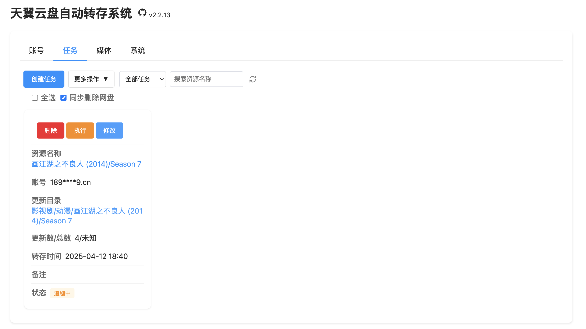
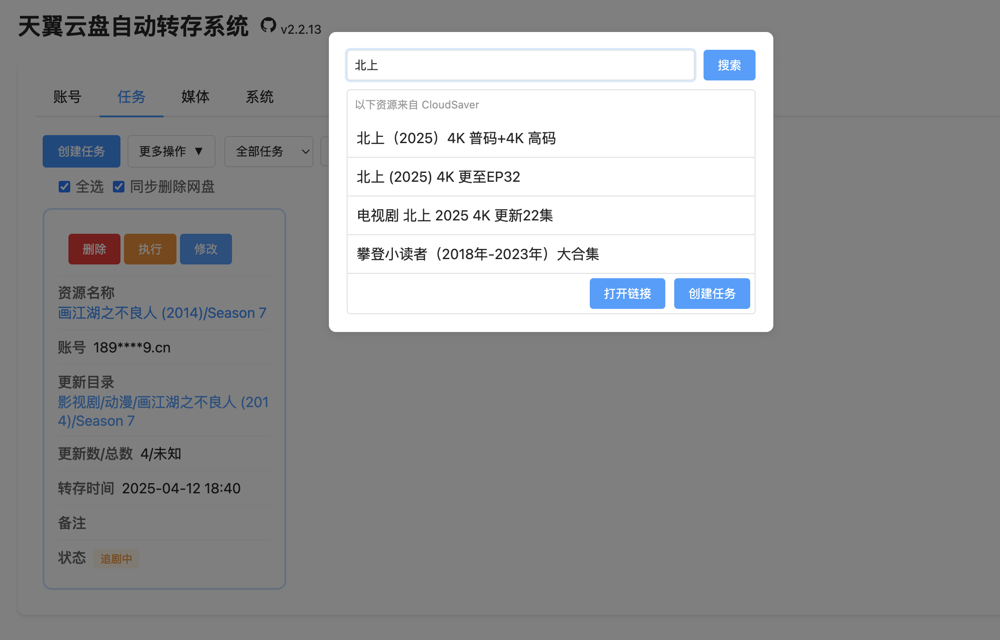
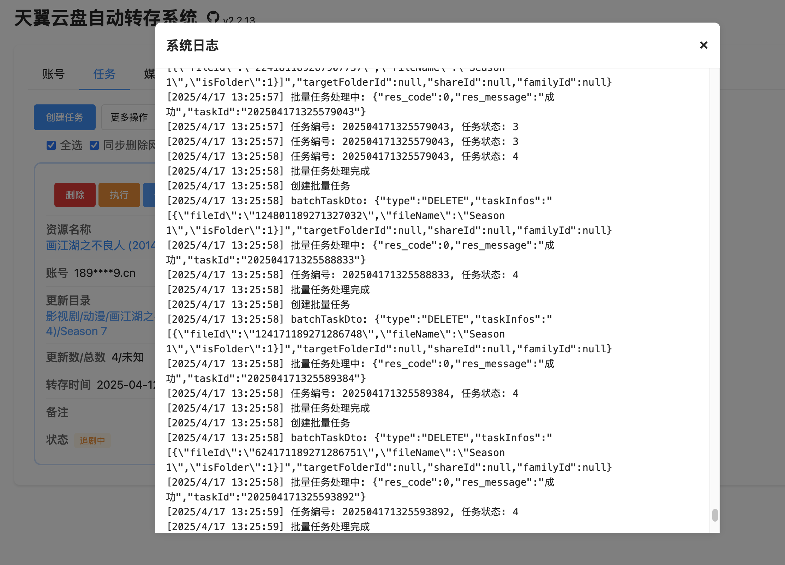
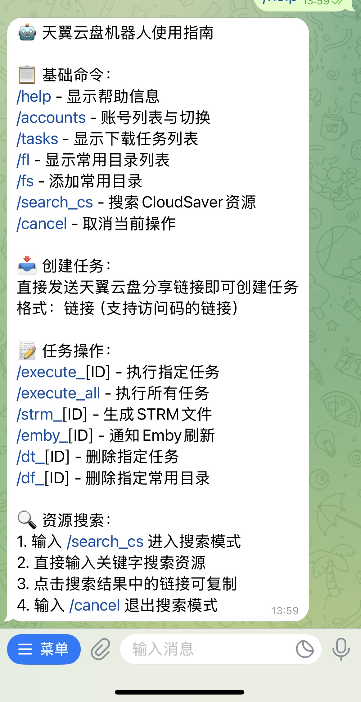
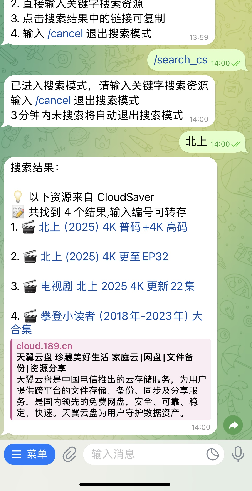
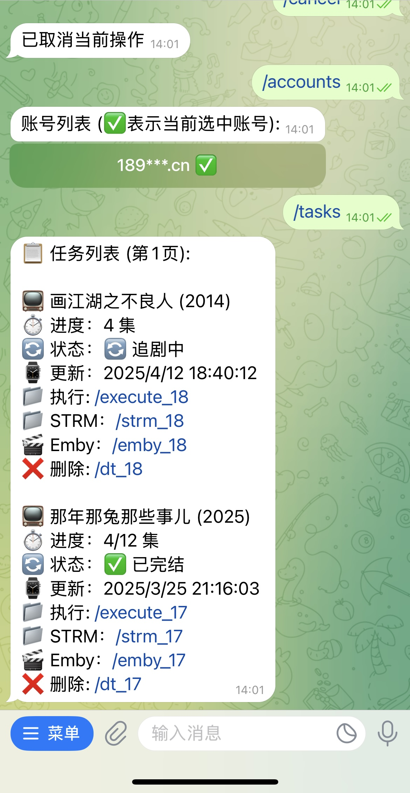

<div align="center">
    
    <h1>cloud189-auto-save</h1>
    <p>天翼云盘自动转存系统，支持自动监控更新并转存文件, 支持STRM生成, Emby入库通知, 支持机器人操作。</p>
    <p align="center">
        <a href="https://github.com/1307super/cloud189-auto-save/releases/latest">
            
        </a>
         <a href="https://github.com/1307super/cloud189-auto-save/stargazers">
            
        </a>
        <a href="https://github.com/1307super/cloud189-auto-save/wiki">
            
        </a>
        <a href="https://hub.docker.com/r/xia1307/cloud189-auto-save">
            
        </a>
    </p>
</div>


## 💬 社区交流
- ~~[Telegram 群组](https://t.me/cloud189_auto_save) - 加入官方群组获取帮助和分享经验~~ 因不知名原因, 账号被封禁
- ~~请加[Telegram 临时群组](https://t.me/cloud189_auto_save2)~~ 也没了
- [Telegram 3群](https://t.me/cloud189_auto_save3) 且加且珍惜
- ## 遇到问题请先查看 [Wiki 文档](https://github.com/1307super/cloud189-auto-save/wiki)

## ⚠️ 安全警告

本项目涉及天翼云盘账号密码、Cookie 等敏感隐私信息，为了确保您的数据安全：

- 请务必私有化部署，不建议将服务暴露在公网
- 不要使用他人搭建的本项目实例，即使是收费的也不要使用
- 所有数据应该掌握在自己手中，不要将账号信息提供给任何第三方
- 建议使用反向代理并配置 HTTPS 加密访问

您的账号安全比使用便利更重要！


## ✨ 功能特点

### 🔄 自动化功能
- 支持定时自动检查任务更新
- 支持自定义任务的定时规则
- 支持自动重试失败任务
- 支持自动清理天翼云盘回收站
- 自动监控分享链接更新, 自动重命名
- AI 辅助功能
   - 支持智普AI、OpenAI等多个支持 OpenAi API的平台
   - 自动识别并重命名文件
   - 智能刮削媒体信息

### 📂 文件管理
- 支持指定转存目录
- 支持保存常用目录

### 🎬 媒体服务
- 支持 STRM 文件生成
  - 支持根据任务新增追更实时生成 STRM 文件
  - 支持根据Alist全量生成 STRM 文件
- 支持 Emby 媒体库更新通知
- 支持CloudSaver资源搜索
- 媒体刮削
   - 支持电影、电视剧自动刮削
   - 自动生成 NFO 文件
   - 自动下载海报、剧集图片

### 🤖 机器人集成
- 支持 Telegram 机器人操作
- 支持任务状态推送通知
- 支持远程添加/删除任务

### 💡 其他特性
- 支持暗黑模式
- 支持多用户管理
- 支持 Docker 一键部署
- 支持 WebUI 可视化管理
- 支持资源搜索功能
- 支持企业微信、Telegram, Bark, Wxpusher 消息推送
- 系统代理分享链接
   - 支持通过系统代理访问分享链接
   - 无需登录即可访问分享内容
   - 支持 Emby 直接播放
- 系统 API Key
   - 提供 REST API 接口
   - 支持第三方程序调用

## 快速开始

## Docker 部署

### 直接使用镜像

```bash
docker run -d \
  -v /yourpath/data:/home/data \
  -v /yourpath/strm:/home/strm \
  -p 3000:3000 \
  --restart unless-stopped \
  --name cloud189 \
  -e PUID=0 \
  -e PGID=0 \
  xia1307/cloud189-auto-save
  ```
注意: `yourpath`请替换为你宿主机的目录; 如果不需要strm功能, 可以不挂载strm目录, 允许配置PUID和PGID, 默认0

### 访问系统

浏览器访问 `http://localhost:3000`，默认账号密码为admin admin 登录后请在系统页修改密码

## 使用说明

<details>
<summary>点击展开使用说明</summary>
    
### 1. 账号管理
- 支持账号密码登录和 Cookie 登录两种方式
- Cookie 登录步骤：
  1. 打开天翼云盘官网登录界面
  2. 打开浏览器的开发者工具(ctrl+f12), 勾选保留日志
  3. 正常发起登录, 然后在开发者工具中选择网络(network)
  4. 在请求中找到 loginSubmit.do, 点击打开详情
  5. 获取 set-cookie 中的 SSON 值（只需要 SSON=xxxxx 中的 xxxxx 部分）
  6. 填入账号创建中的 cookie 中即可
  7. 可点击媒体目录和本地目录设置STRM的访问前缀

### 2. 任务管理
- 创建任务需填写：
  - 选择账号
  - 分享链接（支持加密链接，需填写访问码）
  - 保存目录（支持目录树选择）
  - 总集数（可选，用于追更进度统计）
  - 文件名匹配规则（可选，用于过滤文件）
- 支持批量任务创建：首次创建时会自动识别分享链接中的目录结构
- 支持手动执行任务
- 支持删除任务（可选是否同时删除云盘文件）

### 3. 自动重命名
- 支持两种重命名方式：
  - 正则表达式重命名：支持后续自动更新时应用同样的规则
  - 顺序重命名：适合一次性重命名
- 操作步骤：
  1. 点击任务的更新目录
  2. 选择需要重命名的文件
  3. 点击批量重命名按钮
  4. 选择重命名方式并设置规则
  5. 预览重命名效果
  6. 确认保存

### 4. 系统设置
- 任务设置：
  - 任务过期天数：超过指定天数未更新的任务自动标记完成
  - 任务重试次数和间隔
  - 定时检查时间（支持 Cron 表达式）
  - 自动清空回收站（支持个人和家庭网盘）
- 媒体设置：
  - STRM 文件生成：自动为媒体文件生成对应的 STRM 文件
  - Emby 通知：支持自动刷新 Emby 媒体库
    - 路径替换规则说明：
      1. 示例场景：
         - 天翼云盘中的文件路径：`/影视剧/电视剧/北上/Season 01/S01E01.mkv`
         - Emby 媒体库中的路径：`/cloud/天翼云盘/电视剧`
         - 账号中的Emby路径替换配置：`/影视剧:/cloud/天翼云盘`
      
      2. 替换执行逻辑：
         - 系统会优先尝试完整路径匹配：
           `/cloud/天翼云盘/电视剧/北上/Season 01`
         - 如果完整路径不存在，会逐级向上查找：
           `/cloud/天翼云盘/电视剧/北上`
           `/cloud/天翼云盘/电视剧`
         - 如果所有层级都未找到匹配项，将执行全库扫描
- 消息推送：
  - 企业微信
  - Telegram
  - Bark
  - WxPusher

### 5. Telegram 机器人使用
- 配置说明：
  1. 在 [@BotFather](https://t.me/BotFather) 创建机器人并获取 Token
  2. 在系统设置中填入 Bot Token 并启用 Telegram 通知
  3. 与机器人开始对话即可使用

- 可用命令：
  - `/help` - 显示帮助信息
  - `/accounts` - 显示账号列表
  - `/tasks` - 显示任务列表
  - `/execute_all` - 执行所有任务
  - `/fl` - 显示常用目录列表
  - `/fs` - 添加常用目录
  - `/search_cs` - 搜索CloudSaver资源
  - `/cancel` - 取消当前操作

- 任务操作命令：
  - `/execute_[ID]` - 执行指定任务
  - `/strm_[ID]` - 生成STRM文件
  - `/emby_[ID]` - 通知Emby刷新
  - `/dt_[ID]` - 删除指定任务

- 目录操作命令：
  - `/df_[ID]` - 删除指定常用目录

- 使用流程：
  1. 选择账号：使用 `/accounts` 命令查看并选择要使用的账号
  2. 常用目录管理
     - 使用 `/fl` 查看当前账号的常用目录列表
     - 使用 `/fs` 进入目录树选择模式
     - 在目录树中可以：
       * 点击文件夹名称进入下级目录
       * 点击返回按钮回到上级目录
       * 点击确认按钮保存当前目录
       * 已添加为常用目录的文件夹会显示 ✅ 标记
     - 使用 `/df_[ID]` 可删除指定的常用目录
  3. 创建转存任务
     - 直接发送天翼云盘分享链接即可
     - 支持以下格式：
       * 普通链接：`https://cloud.189.cn/t/xxxxx`
       * 带访问码链接：`https://cloud.189.cn/t/xxxxx（访问码：xxxx）`
     - 发送链接后会显示常用目录列表
     - 选择保存目录后即可创建任务
     - 如目标位置已存在同名文件夹：
       * 会询问是否覆盖
       * 选择是则删除原文件夹后保存
       * 选择否则取消任务创建
  4. 任务管理
     - 使用 `/tasks` 查看当前任务列表
     - 可进行以下操作：
       * `/execute_[ID]` 立即执行指定任务
       * `/strm_[ID]` 为任务生成STRM文件
       * `/emby_[ID]` 通知Emby刷新指定任务
       * `/dt_[ID]` 删除指定任务（可选是否同时删除云盘文件）
     - 使用 `/execute_all` 可执行所有未完成的任务
  5. CloudSaver资源搜索
     - 使用 `/search_cs` 进入搜索模式
     - 直接输入关键字即可搜索
     - 搜索结果支持点击复制链接
     - 点击保存命令可直接创建任务
     - 使用 `/cancel` 或 3分钟未操作会自动退出搜索模式
     

### 6. CloudSaver 资源搜索
- 功能说明：
  - 支持搜索资源并一键创建转存任务
  - 本项目过滤了非天翼云盘资源并根据分享链接去重
  - 支持 Telegram 机器人搜索命令
  
- 部署步骤：
  1. 自行部署 [CloudSaver](https://github.com/jiangrui1994/CloudSaver) 服务
  2. 在系统设置中配置 CloudSaver：
     - 服务地址：填写部署的 CloudSaver 地址
     - 账号：CloudSaver 的登录账号
     - 密码：CloudSaver 的登录密码
  3. 保存配置后即可使用搜索功能

- 使用方法：
  1. Web 界面：在任务页面点击搜索按钮
  2. TG 机器人：使用 `/search_cs` 命令
  3. 选择合适的资源后可一键创建转存任务
      
## 注意事项
- 更新目录可以任意移动但不能被删除, 否则任务无法执行
- 数据库文件会持久化保存在宿主机的 data 目录
- 支持容器自动重启
- 推荐使用反向代理进行安全访问
- 媒体文件后缀配置会影响文件计数和过滤
- STRM 文件生成需要配置正确的访问前缀
- Emby 通知需要配置正确的服务器地址和 API Key
- 如需使用TG机器人创建任务, 如果是老版本系统, 请取消常用目录所有后重新添加

</details>
    
## 📸 界面预览

<details>
<summary>点击展开截图预览</summary>

### Web 界面
<div style="display: flex; flex-wrap: wrap; gap: 20px; justify-content: flex-start;">
    <div style="flex: 0 0 calc(50% - 10px);">
        <h4>任务管理</h4>
        
    </div>
    <div style="flex: 0 0 calc(50% - 10px);">
        <h4>资源搜索</h4>
        
    </div>
    <div style="flex: 0 0 calc(50% - 10px);">
        <h4>媒体库</h4>
        
    </div>
    <div style="flex: 0 0 calc(50% - 10px);">
        <h4>系统日志</h4>
        
    </div>
</div>


### Telegram 机器人界面
<div style="display: flex; flex-wrap: wrap; gap: 20px; justify-content: flex-start;">
    <div style="flex: 0 0 calc(50% - 10px);">
        <h4>帮助信息</h4>
        
        <p>通过 `/help` 命令查看所有可用的命令列表。</p>
    </div>
    <div style="flex: 0 0 calc(50% - 10px);">
        <h4>资源搜索</h4>
        
        <p>使用 `/search_cs` 命令搜索资源。</p>
    </div>
    <div style="flex: 0 0 calc(50% - 10px);">
        <h4>创建任务</h4>
        
        <p>直接发送分享链接或者编号即可创建转存任务。</p>
    </div>
    <div style="flex: 0 0 calc(50% - 10px);">
        <h4>任务列表</h4>
        
        <p>使用 `/tasks` 命令查看当前任务列表。</p>
    </div>
</div>


</details>


## ⚠️ 特别声明

1. 本项目仅供学习交流使用，请勿用于任何非法用途
2. 本项目仅提供天翼云盘资源转存功能，所有接口均为天翼云盘官方接口，本项目不对任何资源内容负责

## 📈 Star History

[](https://star-history.com/#1307super/cloud189-auto-save&Date)

## License

MIT
